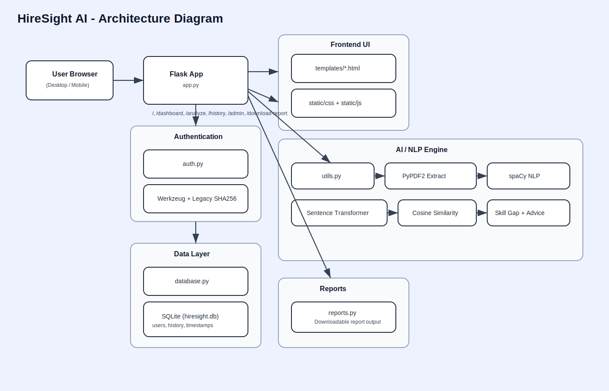

# HireSight AI 🚀

 
 
 
 


**HireSight AI** is a cutting-edge **Smart Resume Analyzer** that helps recruiters and job seekers optimize hiring processes using **AI-powered resume evaluation**. It matches resumes to job descriptions, detects skill gaps, and provides actionable recommendations—all with NLP and semantic similarity techniques.

## 📑 Table of Contents

| Section | Description |
|:---|:---|
| [🌟 Features](#-features) | Role-based access, parsing, and AI scoring |
| [🛠️ Tech Stack](#-tech-stack--architecture) | Backend, NLP libraries, and system architecture |
| [📂 Structure](#-project-structure) | Repository organization and file map |
| [🎬 Live Demo](#-live-demo) | Visual preview of the application in action |
| [⚡ Local Setup](#-local-setup) | Installation and environment configuration |
| [🔐 Admin Login](#-default-admin-login) | Pre-configured credentials for testing |
| [🔑 Environment](#-environment-variables) | Security keys and session protection |
| [⚠️ Guidelines](#-github-upload-guidelines) | Security best practices and .gitignore rules |
| [🎯 Logic](#-why-hiresight-ai) | Why this solution works for recruiters and seekers |
| [🚀 Roadmap](#-roadmap) | Planned integrations and future scaling |
| [🌐 Socials](#-socials) | Contact information and portfolio links |

---

## 🌟 Features

- **Secure Authentication:** Role-based access (`user`, `admin`)  
- **Smart Resume Parsing:** Extract skills, experience, and education from PDFs  
- **AI-Powered Matching:** Semantic similarity scoring using **Sentence Transformers**  
- **Skill Gap Detection:** Identify missing or underrepresented skills  
- **Actionable Recommendations:** Personalized tips to improve resumes  
- **User History:** Track past analyses and improvements  
- **Admin Dashboard:** Analytics for recruiters and team insights  
- **Downloadable Reports:** Generate detailed PDF reports for sharing or records  

---

## 🛠 Tech Stack & Architecture

| Layer | Technologies |
|-------|-------------|
| Backend | Flask, SQLite, Python |
| NLP/ML | spaCy, Sentence Transformers, scikit-learn |
| Frontend | Jinja2 Templates, HTML5, CSS3, JavaScript, Chart.js |
| Security | Session management, role-based access, environment variables |
| Reporting | PDF generation via `reports.py` |

**Architecture Diagram (conceptual):**  


---

## 📂 Project Structure

```text
HireSight-AI/
├─ app.py               # Main Flask app
├─ auth.py              # Authentication & roles
├─ database.py          # SQLite connection & models
├─ utils.py             # Helpers (parsing, scoring)
├─ reports.py           # PDF generation
├─ requirements.txt     # Python dependencies
├─ templates/           # HTML Templates
│  ├─ base.html
│  ├─ index.html
│  ├─ dashboard.html
│  ├─ analyzer.html
│  ├─ history.html
│  └─ admin.html
└─ static/
   ├─ css/style.css
   └─ js/main.js
```
---

## 🎬 Live Demo

  
> Demo showing resume upload, skill analysis, and AI scoring. 
  

---

## ⚡ Local Setup

1. **Clone the repository:**
```bash
git clone https://github.com/manas-shukla-101/HireSight-AI
cd HireSight-AI
```
2. **Create and activate a virtual environment:**
```bash
python -m venv .venv
# Windows (PowerShell)
.venv\Scripts\Activate.ps1
# macOS/Linux
source .venv/bin/activate
```
3. **Install dependencies:**
```bash
pip install -r requirements.txt
python -m spacy download en_core_web_sm
```
4. **Run the application locally:**
```bash
python app.py
```
5. **Open in browser:**
```bash
http://127.0.0.1:5000
```
---

## 🔐 Default Admin Login

- **Username:** `admin`  
- **Password:** `admin123`  

> ⚠️ **Important:** Change the admin password immediately after first login to ensure platform security.

---

## 🔑 Environment Variables

Set a secure secret key to protect session data and user authentication:

```bash
# Windows (PowerShell)
$env:HIRESIGHT_SECRET="your-strong-random-secret"

# macOS/Linux
export HIRESIGHT_SECRET="your-strong-random-secret"
```
---

## ⚠️ GitHub Upload Guidelines

To keep your repository clean and secure, avoid committing the following:

- `.venv/` – virtual environment files  
- `*.db` – database files (e.g., `hiresight.db`)  
- `__pycache__/` – Python cache files  
- Generated reports: `*.pdf`  
- `.env` files containing secrets  

---

## 🎯 Why HireSight AI?

**For Recruiters:** Quickly evaluate resumes, identify top talent, and reduce hiring bias.  
**For Job Seekers:** Understand skill gaps, optimize resumes, and improve interview chances.  
**For Teams:** Track analytics, monitor improvements, and maintain insights.  

> **HireSight AI combines AI intelligence, NLP precision, and user-focused design to make recruitment smarter, faster, and fairer.**

---

## 🚀 Roadmap

- [ ] Multi-language resume support  
- [ ] LinkedIn profile integration for enhanced analysis  
- [ ] Cloud deployment (AWS / Heroku) with HTTPS and authentication  
- [ ] Interactive visualizations for recruiters  
- [ ] Email notifications for analysis reports  

---
---
**Made with ❤️ by Manas Shukla**

---

## 🌐 Socials:
[](https://manas-shukla-portfolio.framer.website) [](https://instagram.com/manas_shukla_101) [](https://linkedin.com/in/manas-shukla-006774370) [](mailto:shuklamanas8928@gmail.com) 

---
